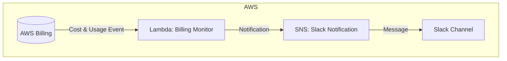

# Architecture Diagram

```mermaid
flowchart TD
    subgraph AWS
        Billing[(AWS Billing)]
        Lambda["Lambda: Billing Monitor"]
        SNS["SNS: Slack Notification"]
        Slack["Slack Channel"]
    end
    Billing -->|Cost & Usage Event| Lambda
    Lambda -->|Notification| SNS
    SNS -->|Message| Slack
```

_This diagram shows the flow from AWS Billing events to Slack notifications via Lambda and SNS._
